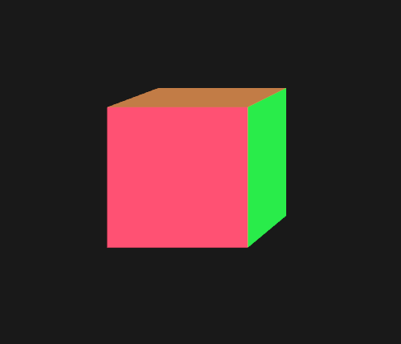
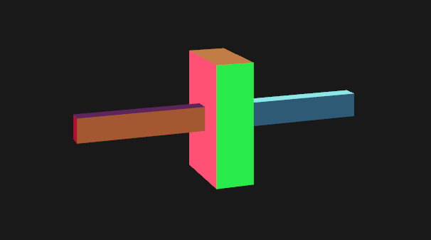

# CADCourseCode_cpp

本项目基于半边数据结构，实现五个基本欧拉操作（`mvfs`，`mev`，`mef`，`kemr`，`kfmrh`）和扫成操作（`sweep`），并构造出三个例子（`cube`，`sixteen_hole`，`two_rods`）

### 项目结构

```C++
.
├── Draw  // 使用OpenGL绘制实体模型
    ├── Draw.hpp
    ├── Draw.cpp
├── EulerOp  // 实现五个基本欧拉操作
    ├── EulerOp.hpp
    ├── EulerOp.cpp
├── HalfEdgeDS  // 半边数据结构
    ├── HalfEdgeDS.hpp
    ├── HalfEdgeDS.cpp
├── Sweep // 扫成操作
    ├── Sweep.hpp
    ├── Sweep.cpp
├── main.cpp  // 构造三个例子
```

### 编译方法

#### 依赖

项目使用`OpenGL`绘制实体模型，具体依赖于如下库：

* `glfw3`
* `OpenGL`
* `GLEW`
* `GLUT`
* `glm`

#### 编译

项目环境如下：

* `Ubuntu 20.04`
* `g++ 7.5.0`

编译方法：

```shell
mkdir build && cd build
cmake ..
make
```

编译成功后，会在build目录下生成`CADCourseCode_cpp`可执行文件。

### 使用方法

`CADCourseCode_cpp`可以输入命令行参数（`1`，`2`，`3`），用于选择待构造的实体模型（不输入参数时，默认选择`2`--`sixteen_hole`）：

* `1`--`cube`：立方体
* `2`--`sixteen_hole`：十六个孔
* `3`--`two_rods`：两个杆

比如，输入`./CADCourseCode_cpp 3`，即可构造`two_rods`模型

#### 运行效果

* `cube`



* `sixteen_hole`


* `two_rods`

